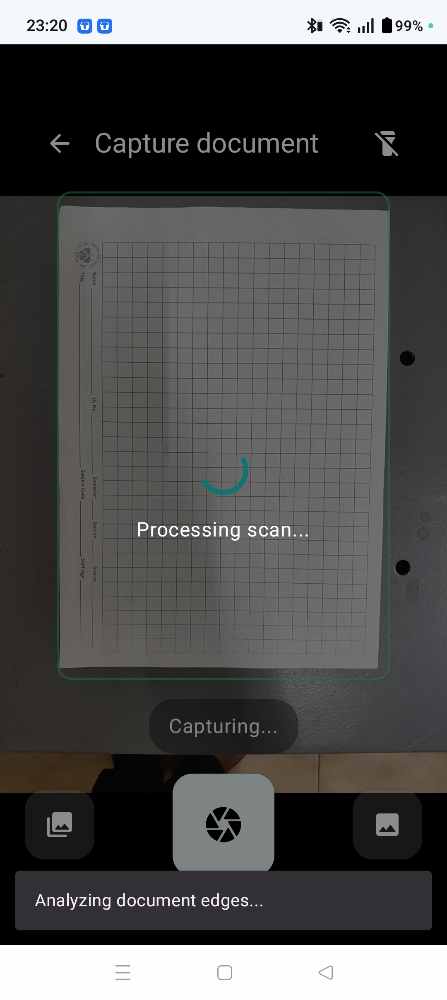
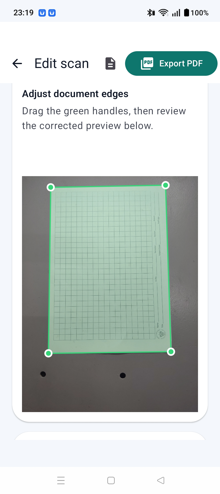

# Document Scanner using OpenCV

## Overview

This project implements an intelligent document scanner capable of automatically detecting the boundaries of a document captured under different background conditions and transforming it into a top-down scanned image.

The scanner combines multiple computer vision techniques including thresholding, edge detection, contour analysis, convex hull generation, polygon approximation, and perspective transformation to accurately detect documents even on textured backgrounds.

The document scanning pipeline was integrated into an interactive application to provide a user-friendly scanning experience. OpenAI Codex was used as a development assistant during the application's implementation.

---

## Features

* Automatic document boundary detection
* Supports multiple background conditions
* Perspective correction
* Automatic corner detection
* Robust contour filtering
* High-resolution scanned output
* Interactive application interface

---

## Technologies Used

- Python
- OpenCV
- NumPy
- Google Colab
- Visual Studio Code
- OpenAI Codex (assisted in application development)

---

## Document Detection Pipeline

```text
Input Image
    ↓
Grayscale Conversion
    ↓
Gaussian Blur
    ↓
Otsu Thresholding
    ↓
Canny Edge Detection
    ↓
Morphological Operations
(Dilation → Erosion → Closing → Opening)
    ↓
Contour Detection
    ↓
Area-based Contour Filtering
    ↓
Convex Hull Generation
    ↓
Polygon Approximation (4 Corners)
    ↓
Corner Point Ordering
    ↓
Perspective Transformation
    ↓
Scanned Document Output
```

## Image Processing Techniques

The project combines multiple OpenCV algorithms to improve robustness under varying lighting conditions and complex backgrounds.

### Image Preprocessing

* Grayscale Conversion
* Gaussian Blur

### Document Detection

* Otsu Thresholding
* Canny Edge Detection

### Morphological Processing

* Morphological Closing
* Morphological Opening
* Dilation
* Erosion

### Shape Detection

* Contour Detection
* Convex Hull
* Polygon Approximation (Douglas-Peucker Algorithm)

### Perspective Correction

* Corner Ordering
* Perspective Transform
* Warp Perspective

---

## Project Demonstration

### Application Interface





### Demo Video

The complete working demonstration of the application is available in the `demo` folder.

## Challenges Addressed

The document scanner was designed to detect documents under different background conditions by combining multiple contour detection strategies instead of relying on a single thresholding method. This improves robustness when scanning documents placed on textured or uneven surfaces.

---

## Working Principle

1. Capture the input image.
2. Convert the image to grayscale.
3. Apply Gaussian Blur to reduce noise.
4. Generate candidate document masks using:

   * Otsu Thresholding
   * Canny Edge Detection
5. Apply morphological operations to remove small artifacts.
6. Detect external contours.
7. Filter contours based on area.
8. Compute the convex hull.
9. Approximate the hull into a quadrilateral.
10. Order the four detected corners.
11. Apply perspective transformation.
12. Produce the final scanned document.

---

## Applications

* Mobile document scanning
* Receipt digitization
* Assignment scanning
* Office document digitization
* OCR preprocessing
* Archiving paper documents

---

## Learning Outcomes

Through this project, I gained practical experience in:

* Image preprocessing
* Thresholding techniques
* Edge detection
* Morphological operations
* Contour analysis
* Convex hull generation
* Polygon approximation
* Perspective transformation
* Building computer vision applications

---

## Future Improvements

* Automatic document enhancement
* Adaptive brightness and contrast correction
* Shadow removal
* OCR integration using Tesseract

---

## Repository Structure

```text
document-scanner-opencv/

├── screenshots/
│   ├── scanning.png
│   ├── result.png
│   └── app_interface.png
│
├── demo/
│   └── document_scanner_demo.mp4
│
└── README.md
```
